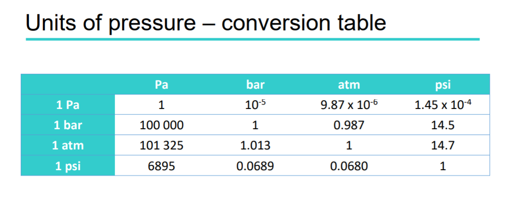
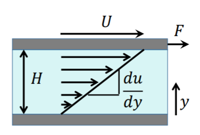
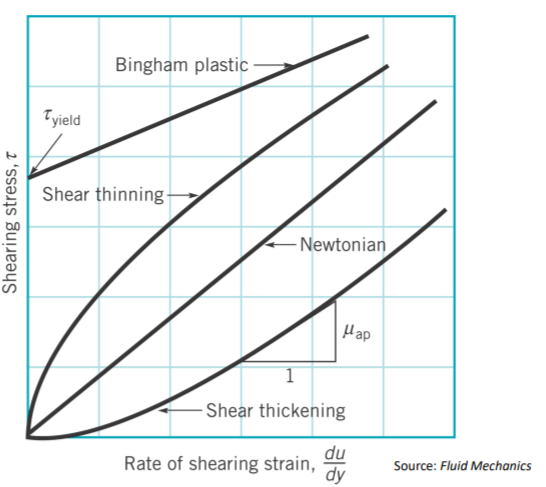
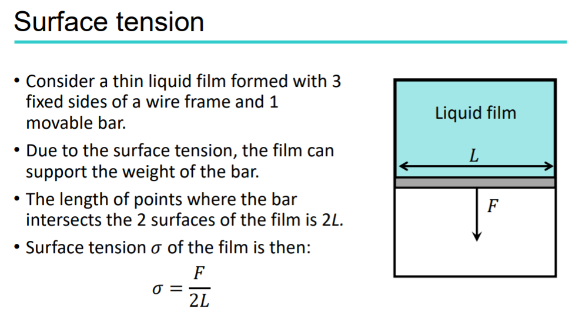
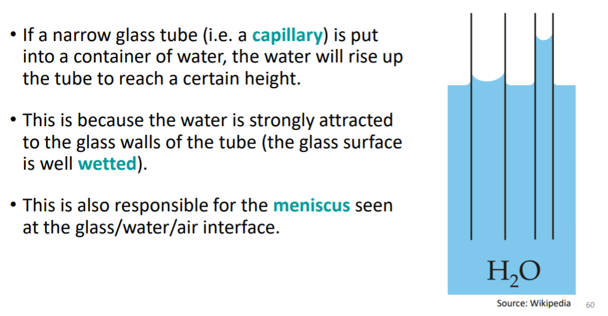
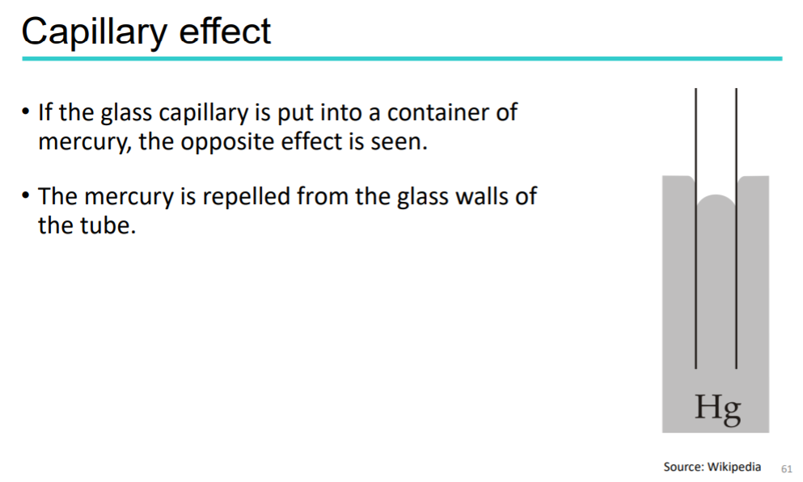
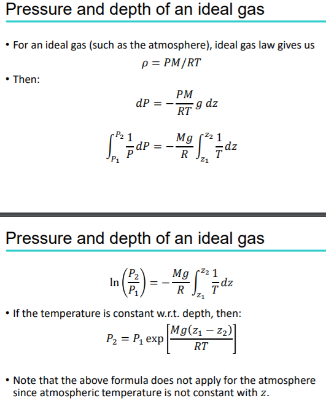

## part 1 Introduction

1. a fluid is a substance that deforms continuously under a shear force of any magnitude

2. Fluids as a continuum
    • We know that fluids are made up of discrete components, i.e. atoms
    or molecules, with empty space in between.
    • However, in fluid mechanics we assume that a fluid is **a continuum i.e. the matter continuously fills all the space it occupies**.
    • This assumption is valid for most length scales

3. Liquids and gases
   Gas is compresible while liquid always remained almost same volume

4. properties of fluids
    - size
    - volume and flowrate
    - speed and velocity
    - pressure
      - $$P={ { F }\over{ A } }$$
      - $$P={ { dF }\over{ dA } }$$
      - Unit $$Pa=N/m^2$$
         
      
      - $$gauge pressure = Absolute pressure - Local atmospheric pressrue$$
    - density
      - $$\rho = { { m }\over{ V } }$$
      - Specific volume: $$v={ { V }\over{ m } }={ { 1 }\over{ \rho } }$$
      - Specific gravity: $$SG={ { \rho }\over{ \rho_H2O@4C } }={ { \rho }\over{ 1000kg/m^3 } }$$
    - stress
      - tensile stress(pulled) vs. compressive stress(squeezed)
      - $$stress={ { F }\over{ A } }$$ where A is a cross-section area
    - shear stress
      - **opposing** forces that are not aligned
      - $$\tau={ { F }\over{ A } }$$
    - viscosity
      - laminar flow 
        
         
        $$strain rate = { { du }\over{ dy } }$$
         
        $$\tau=\mu{ { du }\over{ dy } }$$ with SI unit $$Pa.s$$
      - Newtonian fluids
        fluids with $${ \tau \propto { { du }\over{ dy } } }$$
        - non-Newtonian fluids 
         
          
      - Viscosity is very sensitive to temperature.
         - Liquid viscosities usually decrease with increasing temperature.
         - Gas viscosities usually increase with increasing temperature.
      - Kinematic viscosity (dynamic viscosity)
        - $$\nu={ { \mu }\over{ \rho } }$$
      - Surface tension 
        
        - Surface tension decreases as temperature rises(surfactants)
        - Hydrophillic (low contact angle) vs. Hydrophobic (high contact angle)
        - Capillary effect 
          
           
          
      - Ideal gas law
        - $$PV=nRT$$
          where *P* is the absolute pressure (Pa)
          *n* is the number of moles
          *R* is the universal gas constant, 8.314 J/K.mol
          *T* is the absolute temperature (i.e. in Kelvin)
        - $$\rho={ { PM }\over{ RT } }$$ since $$\rho={ { nM }\over{ V } }$$

## part 2 Fluid statics

1. Hydrostatic pressure
    - the pressure exerted by a static fluid increases with depth within the fluid
    - hydrostatic pressure at a certain depth is the result of the weight of fluid above that depth, then we have
      - $${ P=\rho g \Delta z + P_0}$$
      - similary, for gas we could have 
        
    - some propertistics of pressure
      - Pressure of a fluid at rest is exerted equally in all directions (this principle is called Pascal’s Law)
      - hydrostatic head is the depth of static fluid that has the same pressure as the fluid in question
      - For incompressible fluids, a change in pressure is immediately transmitted throughout the fluid
      - manometers: 760 mm Hg = 1 atm
      - pressure prism 
    - buoyancy
      - $$ F_B = \rho g V $$

2. stability of bodies in fluids
   - stable equilibrium : if, when displaced, it returns to its original position
   - unstable equilibrium if, when displaced, it finds a new equilibrium position
   - force acting point:
     - gravity: centroid of mass
     - buoyancy: cenotriod of displaced volume
