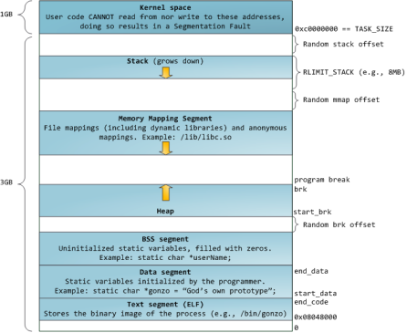

## C++源文件从文本到可执行文件经历的过程

摘抄至[Mr_H9527](https://blog.csdn.net/Mr_H9527/article/details/81156112)

- 预处理
  去掉代码注释，对源代码文件中文件包含关系（头文件）、预编译语句（宏定义）进行分析和替换，生成预编译文件。
- 编译
  生成汇编文件
- 汇编
  转换成机器码，生成可重定位目标文件
- 链接
  链接多个目标文件及所需要的库生成可执行目标文件

  - 合并段
    将重定位目标文件的每个段合并，调整段偏移
  - 符号重定位
    将每个可重定位目标文件的符号表合并解析，需要给每个符号加适当偏移量以确保对应其虚拟内存位置。ELF文件中，有一个叫重定位表的结构专门用来保存这些与从定位有关的信息，重定位表在elf文件中往往是一个或多个段

## include 头文件顺序

对于include的头文件来说，如果在文件a.h中**声明**一个在文件b.h中**定义**的变量，而不引用b.h。那么要在a.c文件中引用b.h文件，并且要先引用b.h，后引用a.h,否则汇报变量类型未声明错误。

### 变量声明

变量声明向编译器保证变量以给定的类型和名称存在，这样编译器在不需要知道变量完整细节的情况下也能继续进一步的编译。变量声明只在编译时有它的意义，在程序连接时编译器需要实际的变量声明。  
当您使用多个文件且只在其中一个文件中定义变量时（定义变量的文件在程序连接时是可用的），变量声明就显得非常有用。您可以使用 **extern** 关键字在任何地方声明一个变量。虽然您可以在 C++ 程序中多次声明一个变量，但变量只能在某个文件、函数或代码块中被定义一次。
类似于函数的prototype

### include的""与<>

双引号和尖括号的区别：编译器预处理阶段查找头文件的路径不一样。

- 对于使用双引号包含的头文件，查找头文件路径的顺序为：
  **- 当前头文件目录**
  - 编译器设置的头文件路径（编译器可使用-I显式指定搜索路径）
  - 系统变量CPLUS_INCLUDE_PATH/C_INCLUDE_PATH指定的头文件路径
- 对于使用尖括号包含的头文件，查找头文件的路径顺序为：
  - 编译器设置的头文件路径（编译器可使用-I显式指定搜索路径）
  - 系统变量CPLUS_INCLUDE_PATH/C_INCLUDE_PATH指定的头文件路径

## malloc原理

Malloc函数用于动态分配内存。为了减少内存碎片和系统调用的开销，malloc其采用**内存池**的方式，先申请**大块内存作为堆区**，然后将堆区分为**多个内存块**，以块作为内存管理的基本单位。当用户申请内存时，**直接从堆区分配一块合适的空闲块**。Malloc采用**隐式链表**结构将堆区分成连续的、大小不一的块，包含已分配块和未分配块；同时malloc采用**显示链表**结构来管理所有的空闲块，即使用一个双向链表将空闲块连接起来，每一个空闲块记录了一个连续的、未分配的地址。

### 隐式链表

credit to [qqliyunpeng](https://blog.csdn.net/qqliyunpeng/article/details/91407705) 
Malloc在申请内存时，一般会通过brk或者mmap系统调用进行申请。其中当申请内存小于128K时，会使用系统函数brk在堆区中分配；而当申请内存大于128K时，会使用系统函数mmap在映射区分配。

## C/C++的虚拟内存管理

3G用户空间和1G内核空间

32bitCPU可寻址4G线性空间，每个进程都有各自独立的4G逻辑地址，其中0~3G是用户态空间，3~4G是内核空间，不同进程相同的逻辑地址会映射到不同的物理地址中。其逻辑地址其划分如下：

各个段说明如下：

- 静态区域：
  - text segment(代码段):包括只读存储区和文本区，其中只读存储区存储字符串常量，文本区存储程序的机器代码。
  - data segment(数据段)：存储程序中已初始化的全局变量和静态变量
  - bss segment：存储未初始化的全局变量和静态变量（局部+全局），以及所有被初始化为0的全局变量和静态变量，对于未初始化的全局变量和静态变量，程序运行main之前时会统一清零。即未初始化的全局变量编译器会初始化为0
- 动态区域：
  - heap（堆）： 当进程未调用malloc时是没有堆段的，只有调用malloc时采用分配一个堆，并且在程序运行过程中可以动态增加堆大小(移动break指针)，从低地址向高地址增长。分配小内存时使用该区域。堆的起始地址由mm_struct 结构体中的start_brk标识，结束地址由brk标识。
  - memory mapping segment(映射区):存储动态链接库等文件映射、申请大内存（malloc时调用mmap函数）
  - stack（栈）：使用栈空间存储函数的返回地址、参数、局部变量、返回值，从高地址向低地址增长。在创建进程时会有一个最大栈大小，Linux可以通过ulimit命令指定。

## 如何判断内存泄漏

- 使用linux环境下的内存检测工具Valgrind，mtrace
- 在代码中添加内存申请和释放的统计功能，统计当前申请和释放的内存是否一致

## segment fault

通常发生在访问非法内存地址的时候，如：

- 使用野指针
- 试图修改字符串常量的内容

## memory leakage

- heap leak
  malloc/realloc/new等分配的内存未释放

- resource leak
  主要指程序使用系统分配的资源比如 Bitmap,handle ,SOCKET等没有使用相应的函数释放掉，导致系统资源的浪费，严重可导致系统效能降低，系统运行不稳定

- 没有将基类的析构函数定义为虚函数
  当基类指针指向子类对象时，如果基类的析构函数不是virtual，那么子类的析构函数将不会被调用，子类的资源没有正确是释放，因此造成内存泄露。

## new vs malloc

| new | malloc |
| --- | ------ |
| 内存按照数据类型进行分配 | 按照指定大小分配 |
| 返回对象指针 | 返回null |
| delete 调用析构函数 | free 不调用|
| new 是类可以重载的操作符 | malloc 是库函数 |
| new 不能扩容 | 可以用remalloc扩容 |
| 分配失败返回bad_malloc | 分配失败返回null |
| new []/delete [] 多次调用构造函数/析构函数 | malloc需要集体分配 |

## 共享内存 API

Linux允许不同进程访问同一个逻辑内存，提供了一组API，头文件在sys/shm.h中。

- 新建共享内存
  int shmget(key_t key,size_t size,int shmflg);
  key：共享内存键值，可以理解为共享内存的唯一性标记。
  size：共享内存大小
  shmflag：创建进程和其他进程的读写权限标识。

- 连接共享内存到当前进程的地址空间shmat
  void \*shmat(int shm_id,const void *shm_addr,int shmflg);
  shm_id：共享内存标识符
  shm_addr：指定共享内存连接到当前进程的地址，通常为0，表示由系统来选择。shmflg：标志位
  返回值：指向共享内存第一个字节的指针，失败返回-1

- 当前进程分离共享内存shmdt
  int shmdt(const void *shmaddr);

- 控制共享内存shmctl
  和信号量的semctl函数类似，控制共享内存
  int shmctl(int shm_id,int command,struct shmid_ds *buf);
  shm_id：共享内存标识符
  command: 有三个值
  IPC_STAT:获取共享内存的状态，把共享内存的shmid_ds结构复制到buf中。
  IPC_SET:设置共享内存的状态，把buf复制到共享内存的shmid_ds结构。
  IPC_RMID:删除共享内存
  buf：共享内存管理结构体。

## reactor（事件驱动模型）模型

- \***Synchronous Event Demultiplexer（同步事件复用器）**：阻塞等待一系列的Handle中的事件到来，如果阻塞等待返回，即表示在返回的Handle中可以不阻塞的执行返回的事件类型。这个模块一般使用操作系统的select来实现。
- \***Initiation Dispatcher（事件分发器）**：用于管理Event Handler，即EventHandler的容器，用以注册、移除EventHandler等；另外，它还作为Reactor模式的入口调用Synchronous Event Demultiplexer的select方法以阻塞等待事件返回，当阻塞等待返回时，根据事件发生的Handle将其分发给对应的Event Handler处理，即回调EventHandler中的handle_event()方法。
- \***Event Handler（事件处理器）**：定义事件处理方法：handle_event()，以供InitiationDispatcher回调使用。
- **Handle**：即操作系统中的句柄，是对资源在操作系统层面上的一种抽象，它可以是打开的文件、一个连接(Socket)、Timer等。由于Reactor模式一般使用在网络编程中，因而这里一般指Socket Handle，即一个网络连接。
- **Concrete Event Handler**：事件EventHandler接口，实现特定事件处理逻辑。

## 单线程方式处理高并发（属于阻塞）

1. 复用I/O来处理多个请求
2. 用事件驱动检测事件
3. 用异步回调处理事件

### select

- 内置数组的形式使得select的最大文件数受限与FD_SIZE
- 每次调用select前都要重新初始化描述符集，将fd从用户态拷贝到内核态，每次调用select后，都需要将fd从内核态拷贝到用户态
- 轮寻排查当文件描述符个数很多时，效率很低

### poll

通过一个**可变长度**的数组解决了select文件描述符受限的问题。数组中元素是结构体，该结构体保存描述符的信息，每增加一个文件描述符就向数组中加入一个结构体，结构体只需要拷贝一次到内核态。poll解决了select重复初始化的问题。**轮寻排查的问题未解决**。

### epoll

epoll：轮寻排查所有文件描述符的效率不高，使服务器并发能力受限。因此，epoll采用只返回**状态发生变化的文件描述符**，便解决了轮寻的瓶颈。

- LT （level tigger）
  当epoll_wait检测到描述符事件发生并将此事件通知应用程序，应用程序可以不立即处理该事件。下次调用epoll_wait时，会再次响应应用程序并通知此事件。

- ET （edge tigger）
  当epoll_wait检测到描述符事件发生并将此事件通知应用程序，应用程序必须立即处理该事件。如果不处理，下次调用epoll_wait时，不会再次响应应用程序并通知此事件。

ET模式在很大程度上减少了epoll事件被重复触发的次数，因此效率要比LT模式高。epoll工作在ET模式的时候，必须使用非阻塞套接口，以避免由于一个**文件句柄的阻塞读/阻塞写操作**把处理多个文件描述符的任务饿死。

#### epoll 使用方法

- epoll_create(int size)
  创建epoll对象
- epoll_ctl(int field, int op, int fd, struct epoll_event *event)
  对epoll对象进行操作，把需要监控的描述添加进去，这些描述如将会以epoll_event结构体的形式组成**一颗红黑树**
- int epoll_wait(int epfd, struct epoll_event *events,int maxevents, int timeout)
  用其进行阻塞，进入大循环，当某个fd上有事件发生时，内核将会把其对应的结构体放入到一个链表中，返回有事件发生的链表。

## C++ STL 内存分配

1. 第一级配置器 \(credit to [honeyRJ](https://blog.csdn.net/baidu_37964071/article/details/80464824) )
   - 分配内存大于128 byte时，直接使用malloc, free, realloc
   - 第一级分配失败时，会尝试使用oom_alloc函数重新尝试分配内存，如果未指定new-handler,抛出__THROW_BAD_ALLOC这个异常

2. 第二级配置器 \(credit to [honeyRJ](https://blog.csdn.net/baidu_37964071/article/details/80528566) )
   - 分配内存小于128 byte时，使用第二级配置器
   - 二级内存池
     二级配置器采用内存池管理（次层配置）。每次配置一大块内存，并维护16个空闲链表（8 - 128）。
     - 空间配置函数allocate
       先判断是否小于128byte，若小于等于则直接从空闲链表里面取（取走链表第一个，把第二个node置为顶点）。若没有则调用refill填充空间
   - refill
     调用refill来填充某个空闲链表，内存取自于二级内存池。default取20个数据块，如果内存池不足则尽可能取多的节点,把第一个节点直接返回，剩下的如果有则直接挂到对应空闲链表里。
     如果一个节点都取不出则将二级内存池剩余内存挂到对应的空闲链表里，并重新用malloc给二级内存分配空间（一次所申请的内存大小为2 \* 所 节点内存大小（提升后）* 20 + 一段额外空间）。
     如果malloc失败则从去比该需要内存大的空闲链表拔出一个节点使用。
     如果查找失败，则调用一级内存的oom_allocate()
   - deallocate
     若释放内存小于等于128bytes，直接插到对应空闲链表内；否则直接free

## 同步/异步 vs 阻塞/非阻塞

credit to [honeyRJ](https://my.oschina.net/xianggao/blog/661085)

- 同步/异步：消息通知机制
- 阻塞/非阻塞：等待消息通知时的状态
